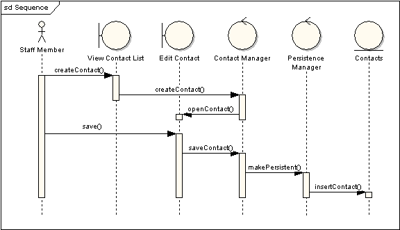

# 概述

交互图描述对象之间的动态合作关系及合作关系的时间顺序。交互图包含两种，序列图和协作图。

# 序列图

序列图也叫时序图，是一个二维图。纵轴表示时间轴，横轴表示合作关系中的各个独立对象的类元角色。

## 类元角色

类元角色用生命线表示。当对象存在时，角色用一条虚线表示；当对象的过程处于激活状态时，用向下延伸的细条状矩形表示。

## 消息

用箭头表示消息。消息可以是同步的，也可以是异步的。

* 实箭头，同步消息（隐含一条返回消息）
* 实线箭头，发送的异步消息
* 虚线，返回的异步消息

## 内部通信

当类元角色的操作为递归调用，或者一个方法调用同一个对象的其他方法时，即为内部通信。

## 迷路消息和拾取消息

迷路消息是那些发送了却没有到达指定接收者，或者到达的接收者不再当前图中。拾取消息是收到来自那些未知的发送者，或者来自没有显示在当前图的发送者的消息。

## 期限约束

消息默认是直线展示。但是考虑到存在有时间限制的业务，所以可以将消息设置为斜线，表示消息有期限约束。

## 复合片段

复合片段用于表示一个或多个处理顺序被包含在一个框架中，并在指定名称的环境下执行。为了更好的表达复杂逻辑，可以把该逻辑加入图中，并放置于复合片段的标题下。

# 协作图

也叫通信图，和序列图类似，但协作图更侧重于对象间的联系。

## 对象

对象角色矩形上标有类或对象名（或者都有）。类名前面有个冒号（：）。

## 消息

协作图的每个消息都有一个序列号。顶层消息的数字是1。同一个等级的消息（也就是同一个调用中的消息）有同样的数字前缀，再根据他们出现的顺序增加一个后缀1，2等等。
# 参考资料

* [DESIGN-时序图](https://dunwu.github.io/design/uml/UML%E8%A1%8C%E4%B8%BA%E5%BB%BA%E6%A8%A1%E5%9B%BE.html#%E6%97%B6%E5%BA%8F%E5%9B%BE)
* [DESIGN-通信图](https://dunwu.github.io/design/uml/UML%E8%A1%8C%E4%B8%BA%E5%BB%BA%E6%A8%A1%E5%9B%BE.html#%E9%80%9A%E4%BF%A1%E5%9B%BE)